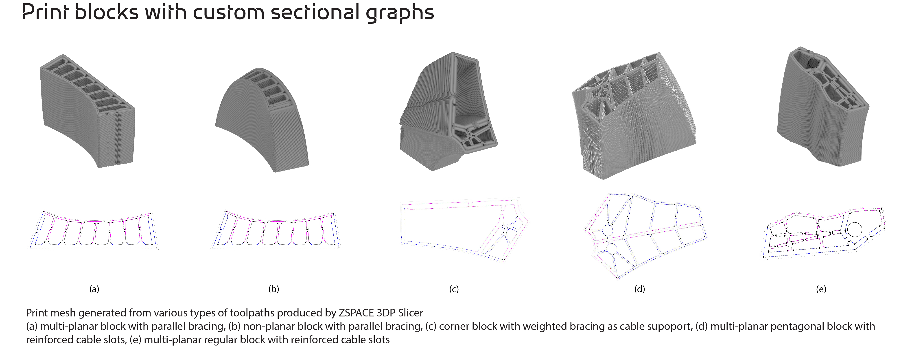

# ZSPACE 3DPSlicer - A SDF-based Mesh Slicing Library


## Introduction

The presented toolkit is driven by the rapid advancement of large-scale 3D concrete printing (3DCP) and addresses the current lack of design tools and integrated design-to-production (DTP) solutions tailored to this fabrication method. It is founded on a novel insight: that design and analysis methods traditionally developed for unreinforced masonry can be effectively adapted to layered, large-scale 3D printing with compression-favouring materials such as concrete. 

At the core of this initiative is the **3DP Slicer**, an open-source computer-aided design (CAD) toolkit. This slicer forms an important component of a broader, integrated DTP framework that has been field-tested across multiple projects to realize the geometric and structural advantages of 3DCP. (See the [Pilot Projects](#pilot-projects) section for further details.) The slicer is embedded within [ZSPACE](documentation/zSpace.md), a proprietary, state-of-the-art computational framework primarily developed in C++. 

The toolkit employs a **mesh-based geometry-processing paradigm**, which is widely recognized in structure- and fabrication-aware geometry processing. It adopts **JavaScript Object Notation (JSON)** and **half-edge mesh data structures** — standard tools in this domain — for the transmission and manipulation of 3D model data. 

To generate cross-sectional profiles, the toolkit uses **weighted plane interpolations** and **geodesics** to slice the input geometry. These profiles are then refined using **Signed Distance Fields (SDFs)** and Boolean operations. This process allows precise control over cross-sectional thicknesses, supports the specification of print widths and infill patterns - enabling the inclusion of local stiffeners and slots for post-tensioning cables— and facilitating the creation of a continuous print path. 



## Pilot Projects


### Striatus Bridge
**Venice, 2021** - Striatus is an arched, unreinforced masonry footbridge composed of 3D-printed concrete blocks assembled without mortar.
<font color="grey" size="2"><i>Project developed by the Block Research Group (BRG) at ETH Zurich, Zaha Hadid Architects Computation and Design Group (ZHACODE), incremental3D (in3D), and Holcim.</i></font>

[Website](https://www.zaha-hadid.com/design/striatus/) • [Paper](https://www.sciencedirect.com/science/article/pii/S0141029623009495) • [Video](https://www.youtube.com/watch?v=kq2WJ8N5D0o&t=103s)

### Striatus Bridge 2.0: Phoenix
**Lyon, 2024** - Phoenix, as an iteration of the Striatus bridge, shows a significant advancement in the application of an unreinforced-masonry structural logic to 3D concrete printing (3DCP), mainly on circularity, environmental impact reduction, and structural robustness aspects. 
<font color="grey" size="2"><i>Project developed by the Block Research Group (BRG) at ETH Zurich, Zaha Hadid Architects Computation and Design Group (ZHACODE), incremental3D (in3D), and Holcim.</i></font>

[Website](https://www.zaha-hadid.com/2024/01/05/phoenix-the-new-3d-printed-concrete-bridge/) • [Paper](https://www.researchgate.net/profile/Alessandro-Dellendice/publication/379595580_STRIATUS_20_PHOENIX_-_IMPROVING_CIRCULARITY_OF_3D-CONCRETE-PRINTED_UNREINFORCED_MASONRY_STRUCTURES/links/6614ecc643f8df018de76b34/STRIATUS-20-PHOENIX-IMPROVING-CIRCULARITY-OF-3D-CONCRETE-PRINTED-UNREINFORCED-MASONRY-STRUCTURES.pdf?origin=scientificContributions) • [Video](https://www.youtube.com/watch?v=Kvrg0pVGOhs)

### NatpowerH Hydrogen Refuelling Stations
**2023 - present** - The world's first green hydrogen refuelling infrastructure for the creational boating industry in Italy. 
<font color="grey" size="2"><i>Project developed by Natpower Group and designed by Zaha Hadid Architects with Foreign Engineers and incremental3D (in3D).</i></font>
[Website](https://www.zaha-hadid.com/architecture/natpower-h-hydrogen-refuelling-stations/) • [Video](https://www.youtube.com/watch?v=cMIW7WFBSBs)

## Demo
A pre-compiled demo executable is available in the [releases](https://github.com/GitZHCODE/zspace_3DPSlicer/releases) section. This demo includes:

- Pre-built Windows executable
- Sample data files
- Basic usage instructions

To run the demo:
1. Download the latest release
2. Extract the zip file
3. Run `zSpace3DPSlicer.exe`
4. Follow the on-screen instructions to load and slice meshes

The demo provides a simple interface to test the core functionality without requiring compilation.

A video demonstration of the slicer's capabilities can be found here:
[](https://www.youtube.com/watch?v=54DTETqvvwc)

The demo showcases:
- Loading and visualizing 3D meshes
- Configuring slicing parameters
- Generating print paths
- Exporting results
- Real-time visualization of slicing results


## Installation
zSpace 3DPSlicer is a **header-only** library with visualization capabilities provided by the ALICE viewer.

### Requirements
* Visual Studio 2019+ (Windows)
* [zSpace ALICE platform](https://github.com/GitZHCODE/zspace_alice) for visualization

### Setup
```bash
# Clone the slicer library
git clone https://github.com/GitZHCODE/zspace_3DPSlicer.git
```

### Usage
1. **Include headers**: Add `include/` to your project's include path
2. **Launch viewer**: Build and run `zspace_alice/ALICE_PLATFORM/ALICE.sln` (Release_zSpaceDLL configuration)
3. **Integrate**: Use ALICE viewer for visualizing meshes, scalar fields, and slicing results

## Dependencies

### Required Dependencies

The library has some dependencies on third-party tools and services, which have different licensing as listed below.
Thanks a lot!

- [**OPENGL**](https://www.opengl.org/about/) for display methods. End users, independent software vendors, and others writing code based on the OpenGL API are free from licensing requirements.

- [**OpenNURBS**](https://github.com/mcneel/opennurbs) for NURBS geometry. It is an open source project licensed under [MIT License](https://opensource.org/licenses/MIT).

- [**Eigen**](https://github.com/eigenteam/eigen-git-mirror) for matricies and related methods. It is an open source project licensed under [MPL2](https://www.mozilla.org/MPL/2.0/).

- [**JSON for Modern C++**](https://github.com/nlohmann/json) to create a JSON file. It is an open source project licensed under [MIT License](https://opensource.org/licenses/MIT).

- [**SQLITE**](https://www.sqlite.org/index.html) for SQL database engine. It is an open source project dedicated to the [public domain](https://en.wikipedia.org/wiki/Public_domain).

- [**freeglut**](https://www.transmissionzero.co.uk/software/freeglut-devel/) for OpenGL utility toolkit. It is an open source project licensed under [MIT License](https://opensource.org/licenses/MIT).

- [**gl2ps**](https://geuz.org/gl2ps/) for OpenGL to PostScript printing library. It is an open source project licensed under [GNU Lesser General Public License](https://www.gnu.org/licenses/lgpl-3.0.html).

- [**GLEW**](https://github.com/nigels-com/glew) for OpenGL Extension Wrangler Library. It is an open source project licensed under [MIT License](https://opensource.org/licenses/MIT).

- [**libGizmo**](https://github.com/CedricGuillemet/ImGuizmo) for 3D gizmos for ImGui. It is an open source project licensed under [MIT License](https://opensource.org/licenses/MIT).

- [**polyClipper**](https://github.com/LLNL/PolyClipper) for polygon clipping operations. It is an open source project licensed under [BSD License](https://github.com/LLNL/PolyClipper/blob/master/LICENSE).


## Quick Start
1. **Set up your project**: Include the necessary headers
2. **Initialize the slicer**: Create a `zTsSDFSlicer` object
3. **Load geometry**: Use `setFromJSON()` to load your mesh data
4. **Create field**: Set up the scalar field with `createFieldMesh()`
5. **Compute slices**: Run `computePrintBlocks()` to generate slicing data
6. **Export results**: Use `exportJSON()` to save your results

For detailed examples, see our [video tutorial](documentation/zTsSDFSlicer.md).

## License

zSpace 3DPSlicer is licensed under [MIT License](https://opensource.org/licenses/MIT). Some components may have different licenses - please check individual files for details.

## Citation

If you use zSpace 3DPSlicer in your academic projects, please cite our work:

```bibtex
@misc{zspace3dpslicer,
  title = {{zSpace 3DPSlicer}: A SDF-based Mesh Slicing Library},
  author = {[Vishu Bhooshan, Taizhong Chen, Heba Eiz, Vlad Levyant, Lin Wo, Shajay Bhooshan and others]},
  note = {https://github.com/GitZHCODE/zspace_3DPSlicer},
  year = {2025},
}
```

## Acknowledgements

This research was carried out collaboratively between the authors and with the support of Zaha Hadid Architects. We would like to thank all the other contributors - Patrik Schumacher, Henry Louth, Efthymia Douroudi, Ling Mao, Philip Singer.

---

*ZHACODE | Computation and Design Group, Zaha Hadid Architects*
