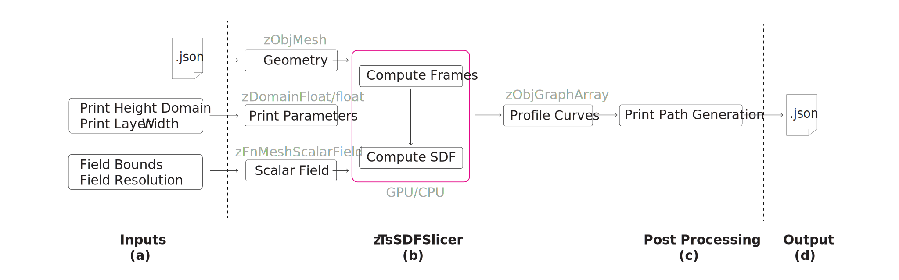
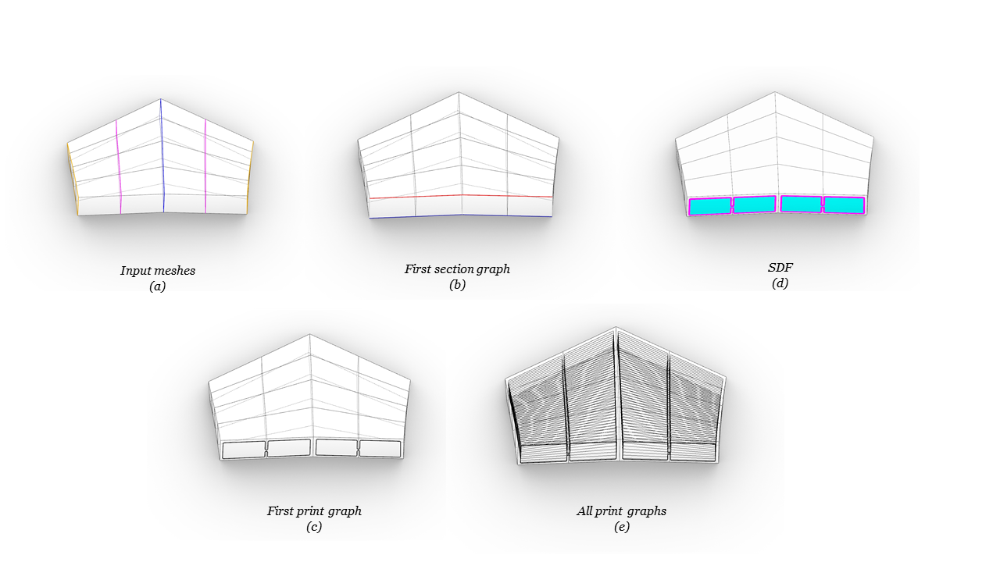
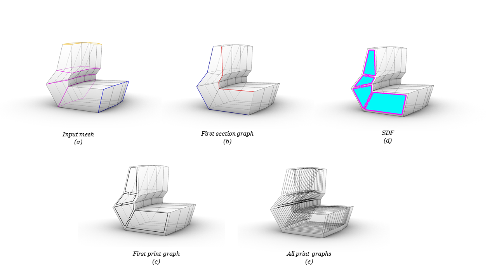
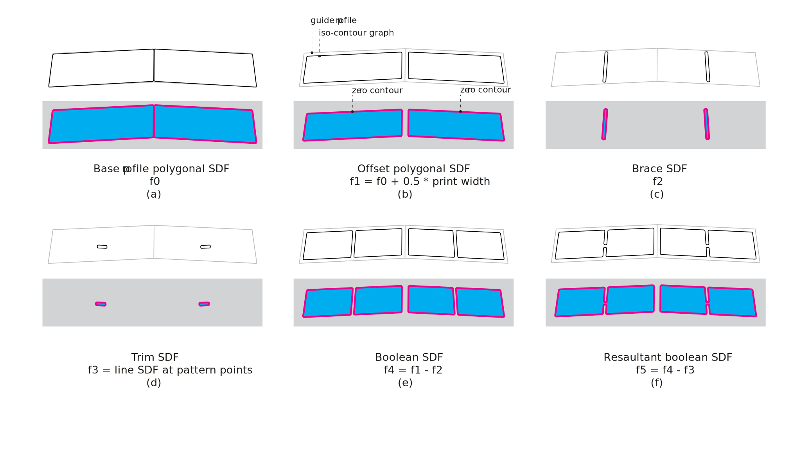
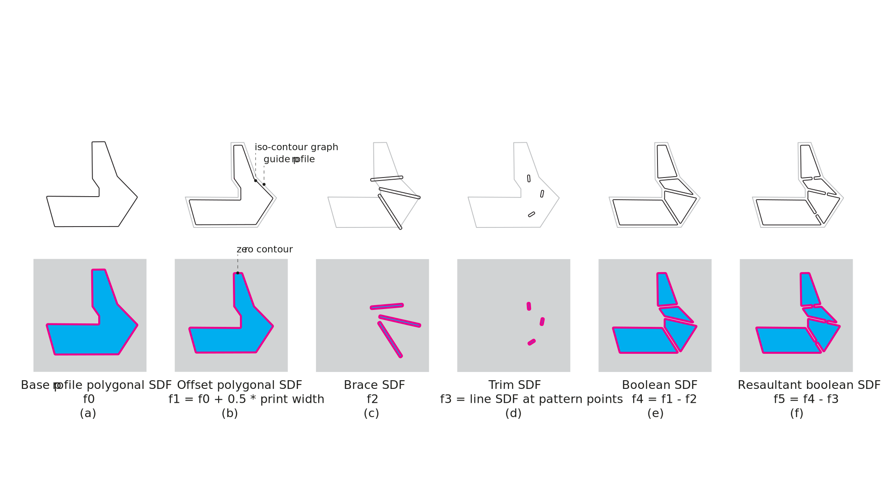
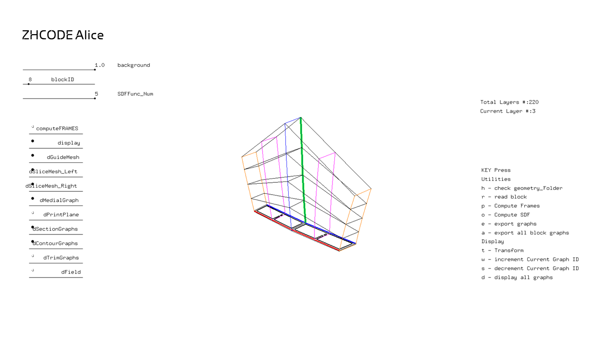

# SDF Slicer

SDF Slicer (zTsSDFSlicer) is a toolset for SDF based mesh slicing.

Namespace: ``zSpace``[[source]](https://github.com/GitZHCODE/zspace_toolsets/blob/main/cpp/source/zToolsets/geometry/zTsSDFSlicer.cpp)

## The Striatus bridge example

A project example showing how to use the mesh SDF Slicer is *Striatus bridge 2.0*. In this case Slicer is used to generate profile curves for 3D printing (3DP). The workflow (Figure 1 a-d) consists of two parts:
* [zTsSDFSlicer](#zTsSDFSlicer) toolset for profile curves creation (Figure 1 b)
* [Post-Processing](#Post-Processing) for print path generation, (Figure 1 c)


<font color="grey">*Figure 1: 3DP Slicer workflow*</font>

The first part has been developed in ALICE platform and the second in Rhino grasshopper. Also, a stand alone application ([SDFSlicer-Rhino](#SDFSlicer-Rhino)) has been developed for this project using zTsSDFSlicer and Post-Processing compute methods and Rhino viewer for visualization.


## zTsSDFSlicer


 The following code is a sketch that can be used to export profile curves for 3D printing.

At first include the header files below.
```c++
#include "main.h"

#include <headers/zApp/include/zObjects.h>`
#include <headers/zApp/include/zFnSets.h>
#include <headers/zApp/include/zViewer.h>
#include <headers/zApp/include/zTsGeometry.h>`
```


Geometry check for all blocks in the file directory. Method `checkPrintBlocks_Folder` checks if layers heights are inside the given domain and intersection areas planar. Then, exports an excel sheet with fabrication criteria information for all blocks.
```c++
//--- Sanity Check 
string fileDir = "data/projectName/JSON_folder/";
zDomainFloat printHeightDomain(0.006, 0.012);
zDomainFloat neopreneOffset(0.000, 0.000);

mySlicer.checkPrintBlocks_Folder(fileDir, printHeightDomain, neopreneOffset);
```


Read the block mesh as well as block and brace stride from JSON file (Figure 2,3 a) with `setFromJSON` method.

```c++
//--- Initialize Slicer
zTsSDFSlicer mySlicer;

//--- Input Mesh
int blockID = 3;
mySlicer.setFromJSON(fileDir, blockID);
```

Created scalar field for the slicer, with field parameters the boundary domain (bb) and resolution (resX, resY).

```c++
//--- Field
zDomain<zPoint> bb = zDomain<zPoint>(zPoint(-0.9, -0.35, 0), zPoint(0.9, 1.5, 0));
int resX = 512;
int resY = 512;

mySlicer.createFieldMesh(bb, resX, resY);
```

Compute print block section frames (Figure 2,3b).

```c++
//--- Compute Frames
float printLayerWidth = 0.048;
bool allSDFLayers = true;
int numSDFLayers =  0;
bool SDFFunc_NumSmooth = 2;
bool computeFrames = true;
bool computeSDF = false;

mySlicer.computePrintBlocks(printHeightDomain, printLayerWidth, allSDFLayers, numSDFLayers, SDFFunc_Num, SDFFunc_NumSmooth, neopreneOffset, computeFrames, computeSDF);
```

Compute SDF field (Figure 2,3 c) at each frame of the print block and create contour graphs (Figure 2,3 d).

```c++
//--- Compute SDF
computeFrames = false;
computeSDF = true;

mySlicer.computePrintBlocks(printHeightDomain, printLayerWidth, allSDFLayers, numSDFLayers, SDFFunc_Num, SDFFunc_NumSmooth, neopreneOffset, computeFrames, computeSDF);
```


<font color="grey">*Figure 2: Deck Block Workflow*</font>



<font color="grey">*Figure 3: Balustrade Block Workflow*</font>

In detail, ```computeBlockSDF_Deck``` and ```computeBlockSDF_Balustrade``` methods compute the scalar field at each layer and returns iso contour graphs for deck and balustrade blocks respectively.
These methods follow the steps in workflow below.

##### Workflow
For the current layer (graphId):
1. Get block section graph.
2. Compute polygon scalar field  ***f~0~*** from section graph *(a)*.
3. Offset polygon scalar field  ***f~1~** (b)*.
4. Get trim graphs.
5. Compute brace field ***f~2~*** as distance from trim graphs *(c)*.
6. Compute trim field ***f~3~*** as distance from points on trim graphs *(d)*.
7. Compute Boolean SDF ***f~4~ = f~1~ - f~2~** (e)*.
8. Compute Boolean SDF ***f~5~ = f~4~ - f~3~** (f)*.
9. Select result field from  ***f~0~*** to ***f~5~***.
10. Get iso contour of the result field.


<font color="grey">*Figure 4: Compute scalar field on deck block*</font>


<font color="grey">*Figure 5: Compute scalar field on balustrade block*</font>

Export the contour graphs (Figure 2,3 a) into JSON file.

```c++
//--- Export
string currentPath = fileDir + to_string(blockID) + ".json";
exportPath = "C:/Users/UserName/Desktop/BlocksExport";
mySlicer.exportJSON(currentPath, exportPath, "3dp_block", printLayerWidth, raftLayerWidth);
```

ZSPACE framework provides ALICE, visualize meshes, their attributes as well as debugging information to test sketches.


---

*ZHACODE | Computation and Design Group, Zaha Hadid Architects*


